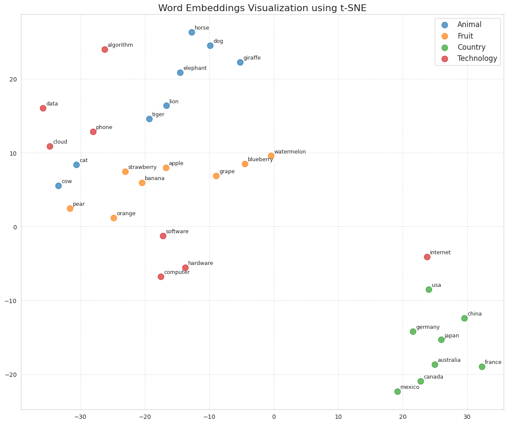

# Latent Space Exploration

A simple exploration of the latent space of deep neural networks. Include models train on texts and models train on images.

The notebooks show how to extract some embeddings from the models (Huggingface models) and visualize the embeddings in 2D using PCA, t-SNE and UMAP.

You can run the tutorials on your local machine by cloning this repo or you can run them in Google Colab by clicking on the "Open in Colab" item. The exploration of the latent space with application to images is in the notebook [image_embedding_visualization.ipynb](https://github.com/bricaud/latentspacetutorial/blob/main/image_embedding_visualization.ipynb), 

The exploration with texts is in [text_embedding_visualization.ipynb](https://github.com/bricaud/latentspacetutorial/blob/main/text_embedding_visualization.ipynb) 

Bonus: A python file where a sparse autoencoder is implemented and tested on a simple neural net trained on MNIST [sparse-autoencoder-demo.py](https://github.com/bricaud/latentspacetutorial/blob/main/sparse-autoencoder-demo.py).

